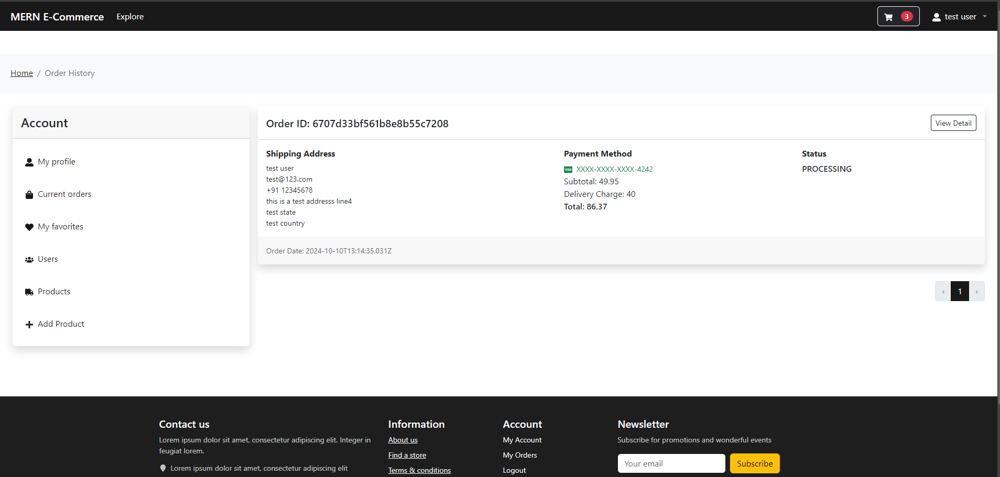

# MERN E-Commerce

A fully working e-commerce web app developed in MERN (MongoDB, Express.js, React.js and Node.js) stack

## Key Features
- React + Bootstrap 5, SCSS for frontend UI/UX
- Express.js + Node.js for backend
- MongoDB for database
- Redux state management
- Stripe payment integration
- JWT token + bcryptjs for authentication
- Advanced product search, filter...etc
- User Profile and Admin pages with protected route
- Cart & Order pages
- And more...

## Screenshots

## Products

## Login

## Register

## User Account

## Cart & Order

